# AI Tic-Tac-Toe with Computer Vision and CLI

A Python project offering multiple interfaces to play Tic-Tac-Toe against AI opponents. Features terminal gameplay with two AI strategies (Minimax and MCTS) and computer vision integration for real-world board analysis.

## Features

### Core Game Modes
- 🎮 **Terminal Gameplay**: Play classic Tic-Tac-Toe in your terminal against AI
- 🤖 **Dual AI Engines**: Choose between:
  - Minimax with alpha-beta pruning (perfect play)
  - Monte Carlo Tree Search (MCTS) opponent
- 📸 **Computer Vision Integration**: Process physical/drawn boards from images
  - Automatic board state detection
  - Optimal move visualization on input images

### Technical Capabilities
- 🖼️ Image Processing Pipeline:
  - Grid detection with OpenCV
  - Cell segmentation and symbol recognition
- 🧠 AI Decision Systems:
  - Minimax (integrated with CV pipeline)
  - MCTS (terminal-only implementation)
- ✍️ Visualization Tools:
  - Move annotation on processed images
  - Terminal-based board display

## Requirements

- Python 3.8+
- OpenCV 4.5+
- numpy 1.20+

## Installation

```bash
git clone https://github.com/mzums/tic-tac-toe.git
cd tic-tac-toe
pip install -r requirements.txt
```

## Usage

### Terminal Game Mode
```bash
python <minimax_or_mcts>/main.py
```


### Computer Vision Mode
```bash
python main.py path/to/image.jpg
```
Options:
- `--show-steps` to display processing stages

<p float="left">
  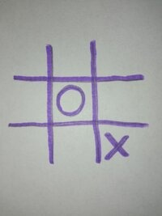
  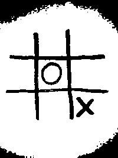
  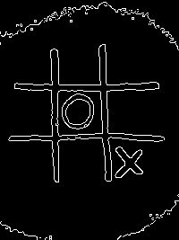
  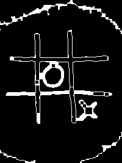
  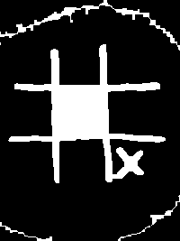
  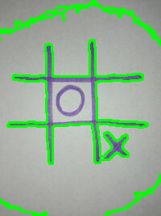
  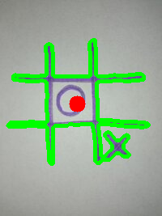
  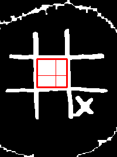
  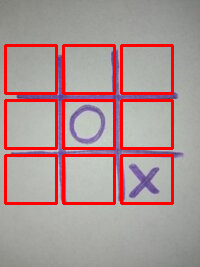
  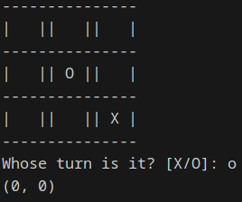
  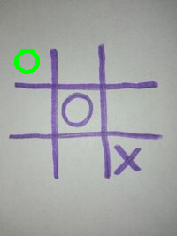
</p>

### Test images:
 avaible in folder ```cv/test_images```  
  
usage:  
```
python main.py cv/test_images/image1.jpg --show_steps
```


## Image Requirements
For best CV performance:
- High contrast between grid and background
- Uniform lighting
- Square board proportions
- Supported formats: JPG, JPEG, PNG, BMP

## License
MIT License. See [LICENSE](LICENSE) for details.

## Contributing
1. Fork repository
2. Create feature branch (`git checkout -b feature/improvement`)
3. Commit changes
4. Push to branch
5. Open Pull Request
